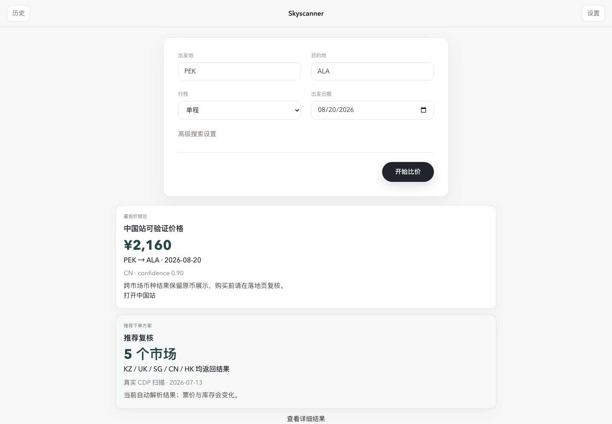
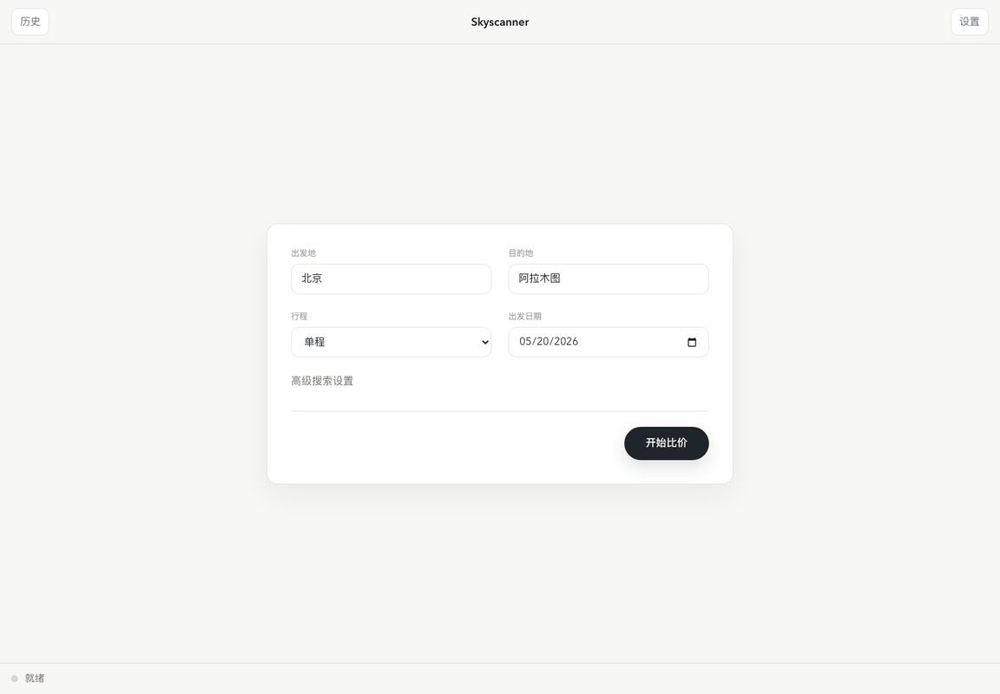
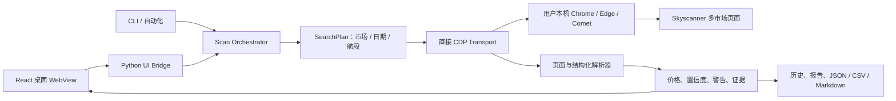

# Skyscanner 多市场比价

> **同一趟航班在不同 Skyscanner 市场可能显示不同价格，但手工逐站搜索慢、难复核，也无法沉淀证据。**

[](https://github.com/Chenke0023/skyscanner_multi_domain/actions/workflows/ci.yml)
[](https://github.com/Chenke0023/skyscanner_multi_domain/releases/latest)
[](https://www.python.org/)

使用本机浏览器的 Chrome DevTools Protocol（CDP），一次扫描多个 Skyscanner 市场，保留价格、解析证据、历史记录及 Markdown/CSV/JSON 导出。桌面 WebView 是主要入口，CLI 用于诊断、自动化和批量导出。



<details>
<summary><strong>查看 60 秒产品演示 GIF</strong></summary>



</details>

## 真实结果

2026-07-13 通过已连接的 Chrome 149 执行了一次真实 CDP 扫描：`PEK → ALA`、出发日期 `2026-08-20`、日期窗口 `0`。五个市场均返回可解析页面价格：

| 市场 | 页面币种 | 页面价格 | 解析置信度 | 状态 |
|---|---:|---:|---:|---|
| 哈萨克斯坦 KZ | KZT | 246 | 0.90 | `page_text` |
| 英国 UK | GBP | 249 | 0.90 | `page_text` |
| 新加坡 SG | SGD | 426 | 0.90 | `page_text` |
| 中国 CN | CNY | 2,160 | 0.90 | `page_text` |
| 香港 HK | HKD | 2,581 | 0.90 | `page_text` |

原始机器可读证据保存在 [`docs/evidence/real-scan-2026-07-13.json`](docs/evidence/real-scan-2026-07-13.json)。票价和库存会实时变化；跨市场币种、税费和销售条件必须在跳转后的落地页再次确认。本项目提供比较与审计证据，不代替出票平台。

## 为什么是现在

- 航司分销、地区定价、汇率和促销使同一路线的跨市场展示更碎片化。
- CDP 可以复用用户已安装并登录的浏览器，不需要内嵌浏览器或维护高成本的备用抓取栈。
- 本地优先架构让搜索历史、页面证据和导出文件留在用户设备上。
- 结构化解析、置信度和失败原因使“自动找到价格”升级为“能解释这个价格从哪里来”。

## 技术架构



稳定路径只有 `page` 直接 CDP transport；`cdp_structured` 是显式启用的实验性解析模式。系统不会跨 transport 静默回退。

## 关键指标

以下是 v1.3.0 主分支的可复现工程指标，不是营销预测：

| 指标 | 当前值 |
|---|---:|
| Python 自动化测试 | 234 passed |
| WebUI 自动化测试 | 6 passed |
| mypy 检查范围 | 51 个源文件，0 errors |
| GitHub Actions | Ruff、mypy、前端测试/构建、release smoke、pytest 全绿 |
| macOS `.app` 大小 | 约 47 MB |
| macOS arm64 ZIP | 约 20 MB |
| 发布门禁 | `.app` ≤ 150 MB；ZIP ≤ 60 MB |
| 本次真实扫描 | 5/5 市场返回可解析结果 |

## 商业假设

以下是假设而非已验证收入或用户数据，适合作为后续访谈和实验的起点：

1. **高频国际旅客和差旅人员**愿意为减少跨地区重复搜索、保存证据和复核价格付费。
2. **旅行顾问及小型代理**比普通消费者更重视批量路线、历史差异和可导出报告。
3. 免费版可提供单路线/少量市场扫描；专业版可围绕批量任务、价格提醒、团队报告和审计历史收费。
4. 产品价值应以“节省的搜索时间、发现的可验证价差、成功复核率”衡量，而不是单纯以抓取次数衡量。
5. 商业化前必须验证 Skyscanner 使用条款、地区合规、价格展示口径和跳转归因方案。

## 快速安装 / 运行

### macOS Apple Silicon

从 [Latest Release](https://github.com/Chenke0023/skyscanner_multi_domain/releases/latest) 下载 `skyscanner-multi-domain-v1.3.0-macos-arm64.zip`。应用采用 ad-hoc 签名，尚未经过 Apple notarization；首次启动可能需要在 Finder 中右键选择“打开”。

### 从源码运行

要求 Python 3.12，以及已安装的 Chrome、Edge、Comet 或可连接的 CDP endpoint：

```bash
python3 -m pip install -r requirements.txt
cd webui && npm install && npm test -- --run && npm run build && cd ..
python3 desktop_webview.py
```

项目不会内嵌或下载浏览器。无法连接或启动系统浏览器时，会返回 `browser-unavailable` 和可操作的安装/启动提示。

CLI 示例：

```bash
python3 cli.py doctor
python3 cli.py page -o PEK -d ALA -t 2026-08-20 --date-window 0
python3 cli.py page -o 北京 -d 阿拉木图 -t 2026-08-20 --output json --output-file result.json
python3 cli.py page -o PEK -d ALA -t 2026-08-20 --transport cdp_structured
```

完整参数见 `python3 cli.py page --help`。

## 主要模块

- `desktop_webview.py`：桌面 WebView 入口
- `desktop_ui_service.py`：桌面 UI bridge
- `webui/`：React 桌面界面
- `cli.py`：CLI 入口
- `skyscanner_multi_domain/transports/cdp.py`：浏览器检测、启动和稳定页面扫描
- `skyscanner_multi_domain/transports/cdp_structured.py`：实验性结构化 CDP 解析
- `skyscanner_multi_domain/scan/`：扫描、历史、报告和导出
- `skyscanner_multi_domain/geo/`：地点、机场和静态国家元数据

## 验证与构建

```bash
python3 -m ruff check .
python3 -m mypy
python3 -m pytest -q
cd webui && npm test -- --run && npm run build
cd .. && python3 scripts/release_smoke.py
```

macOS 构建：

```bash
python3 scripts/generate_icon.py
python3 -m pip install pyinstaller
scripts/build_macos_standalone_app.sh
```

版本由 `data/version.txt` 管理；未发布变更记录在 `CHANGELOG.md` 的 `Unreleased`。
